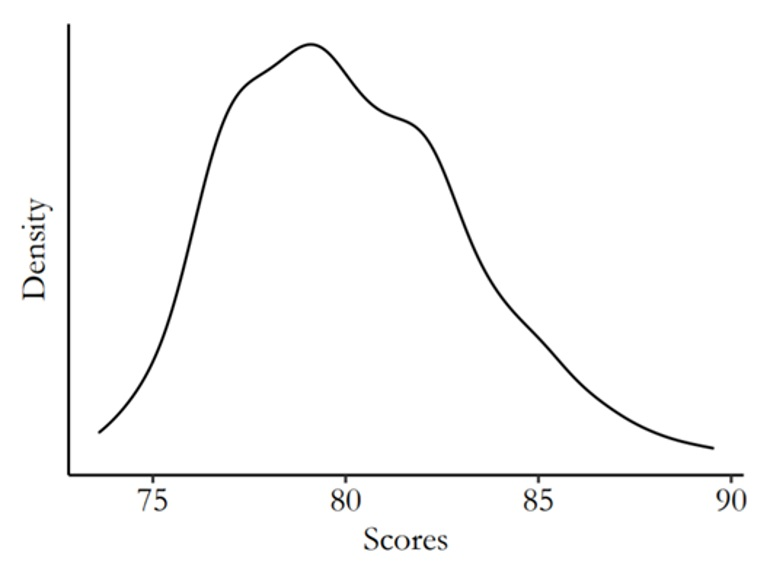

Below are the readings and assignments organized by module and class/date.

For every class you should:

- complete readings;
- submit answers to warmup questions on Canvas by 1 hour before class; and
- turn in homework assignments, printed and in-person to your TF/CA, by the beginning of class.

# **Module 1** --- An introduction to ‘Quantitative Social Science’

## Class 1 (09/02/2026)

### Readings

None

### Warmup questions:

None

### Homework questions:

None

## Class 2 (09/09/2026)

### Readings:

- Chapter 1: Overview from *Regression and Other Stories*
- Chapter 0: Introduction (Welcome & Note to Students) and Chapter 1: Designing Research from *The Effect*

### Warmup questions: Overview of statistics

1.  What are the three challenges of statistical inference?
2.  What are the key skills you should learn from the textbook?
3.  What is the URL of the website with data and examples from the textbook?

### Homework Questions:

1.  **Sketching a regression model and data** (Exercise 1.2 of *Regression and Other Stories*). Figure 1.1b of *Regression and Other Stories* shows data corresponding to the fitted line $y = 46.3 + 3.0x$ with residual standard deviation 3.9, and values of $x$ ranging roughly from 0 to 4%.

    - Sketch hypothetical data with the same range of $x$ but corresponding to the line $y = 30 + 10x$ with residual standard deviation 3.9.
    - Sketch hypothetical data with the same range of $x$ but corresponding to the line $y = 30 + 10x$ with residual standard deviation 10.

2.  **Goals of regression** (Exercise 1.3 of *Regression and Other Stories*). Download data on a topic of interest to you. Without graphing the data or performing any statistical analysis, discuss how you might use these data to:

    - fit a regression to estimate a relationship of interest;
    - use regression to adjust for differences between treatment and control groups; and
    - use a regression to make predictions.

3.  **Problems of statistics** (Exercise 1.4 of *Regression and Other Stories*). Give examples of applied statistics problems of interest to you with challenges in:

    - generalizing from sample to population;
    - generalizing from treatment to control group; and
    - generalizing from observed measurements to the underlying constructs of interest.

    Explain your answers.

# **Module 2** --- Critical thinking: the role of prediction and defining research questions

## Class 1 (09/14/2026)

### Readings:

- Appendices A.1-A.3: Computing in R from *Regression and Other Stories*

### Warmup Questions:

**Coding: sequences, sampling, looping, and vectors**

### Homework Questions:

1.  **Goals of regression** (Exercise 1.5 of *Regression and Other Stories*). Give examples of applied statistics problems of interest to you in which the goals are:

    - forecasting/classification;
    - exploring associations;
    - extrapolation; and
    - causal inference.

    Explain your answers.

2.  **Causal inference** (Exercise 1.6 of *Regression and Other Stories*). Find a real-world example of interest with a treatment group, control group, a pre-treatment predictor, and a post-treatment predictor. Make a graph like Figure 1.8 using the data from this example.

3.  **In pairs: Working through your own example** (Exercise 1.10 of *Regression and Other Stories*). Download or collect data on a topic of interest to you. You can use this example to work through the concepts and methods covered in the book, so the example should be worth your time and should have some complexity. This assignment continues throughout the book as the final exercise of each chapter. For this first exercise, discuss your applied goals in studying this example and how the data can address these goals.

## Class 2 (09/16/2026)

### Readings:

- Chapter 2: Research Questions from *The Effect*

### Warmup Questions:

1.  What is data mining useful for? What are its limitations?
2.  What is the difference between a theory, research question, and hypothesis?

### Homework Questions:

1.  Are each of the following questions a good research question? Explain your reasoning. If a question is not good, suggest ways to make it a better question if possible.

    - Do severe hurricanes cause psychological disorders in children in gestation during the hurricanes?
    - Are dogs the best pets?
    - Do organic labels on grocery-store items increase sales of those items?

2.  Think about a possible research question in your field of study (e.g., your major).

    - Can this question be answered? Is it feasible to answer it?
    - Does the question answer something about how the world works? If so, how?
    - Write down some hypotheses based on the question.
    - What kind of data needs to be collected to test the hypothesis?

3.  For each of the following theories and research questions, does the research question inform theory? That is, does answering the research question tell you something about the theory?

    - **Theory:** People donate to political campaigns largely because they want to defeat a political opponent, not because they like the candidate they are donating to. **Research question:** Do negative advertisements increase political campaign donations in U.S. Congressional races more than positive advertisements do?
    - **Theory:** Men have higher average salaries than women in the U.S. partially because employers discriminate against women in job interviews. **Research question:** Does the use of a gender-blind interview process, where hiring decisions and salary offers are made without knowing the employee's gender, shrink the salary gap between men and women?
    - **Theory:** Living in a rich country improves happiness. **Research question:** Do people who live in richer countries on average report higher happiness levels?
    - **Theory:** Many plants survive without eating because they collect energy from sunlight. **Research question:** Are plants that live underneath a thick canopy, where little light can get through, less healthy than those in a loose canopy?

# **Module 3** --- Back to the basics: data collection, description, and visualization

## Class 1 (09/21/2026)

### Readings:

- Chapter 2: Data and measurement from *Regression and Other Stories*

### Warmup Questions:

1.  In R, create data $x$ taking on the values 0, 0.5, 1, $\ldots$, 10; then create $y = \sqrt{x}$ and make a scatterplot of $y$ versus $x$.
2.  In R, create a plot of the line $y = \sqrt{x}$ for $x$ ranging from 0 to 10.

### Homework Questions:

1.  **Statistics as generalization** (Exercise 1.7 of *Regression and Other Stories*). Find a published paper on a topic of interest where you feel there has been insufficient attention to:

    - generalizing from sample to population;
    - generalizing from treatment to control group; and
    - generalizing from observed measurements to the underlying constructs of interest.

    Explain your answers.

2.  **Statistics as generalization** (Exercise 1.8 of *Regression and Other Stories*). Find a published paper on a topic of interest where you feel the following issues have been addressed well:

    - generalizing from sample to population;
    - generalizing from treatment to control group; and
    - generalizing from observed measurements to the underlying constructs of interest.

    Explain your answers.

3.  **Composite measures** (Exercise 2.1 of *Regression and Other Stories*). Following the example of the Human Development Index in Section 2.1, find a composite measure on a topic of interest to you. Track down its individual components and use scatterplots to understand how the measure works, as was done for that example in the book.

## Class 2 (09/23/2026)

### Readings:

- Chapter 3: Describing Variables and Chapter 4: Describing Relationships from *The Effect*

### Warmup Questions:

1.  What is a variable?

2.  Which of the following commonly represents the truth we are trying to estimate in statistics?

    - English/Latin letters like $x$ and $y$
    - Modifications of English letters like $\bar{x}$
    - Greek letters like $\mu$ and $\beta$
    - Modifications of Greek letters like $\hat{\beta}$

3.  Which term provides a description of the probability that each possible value of a variable will occur?

    - Variation
    - Distribution
    - Range
    - Mean

4.  What is a conditional distribution?

5.  Which term describes a measurement of how much two variables vary with each other?

    - Variance
    - Conditional mean
    - Covariance
    - Local mean

### Homework Questions:

1.  For each of the following variables, what type of variable is it: continuous, count, ordinal, categorical, or qualitative?

    - Age
    - Gender
    - The number of times that the President has tweeted in the past day
    - Income
    - Number of Instagram posts about statistics in the past month
    - The number of unemployment claims filed in the U.S. last week
    - The university or college that a student attends
    - A therapist's written assessment of a patient's symptoms of depression
    - Whether a soccer team is in its league's A division (highest), B division (next highest), or C division (lowest)

2.  Below is a frequency table depicting the salaries of political science professors employed at a university. The `Salary` column contains the salary, and the `Frequency` column contains the number of professors who earn the stated salary.

|    Salary | Frequency |
|----------:|----------:|
|  \$85,000 |         5 |
|  \$90,000 |         4 |
| \$100,000 |         1 |
| \$120,000 |         2 |
| \$125,000 |         3 |
| \$130,000 |         2 |

- Calculate the average salary earned by professors in the Economics department.
- Calculate the median.
- Calculate the minimum and maximum.
- Calculate the interquartile range.

3.  The following graph represents the final-exam scores for 1,000 students who took an Introduction to Statistics course at a university.



- Describe the distribution.
- Is there skewness to the data?
- Would the mean or the median be a better measure to describe the center of the distribution?
- What measure would you use to describe the variability in the distribution?

4.  The fictional table below depicts data collected from 3,000 university students on their classification (Freshman, Sophomore, Junior, Senior) and whether they receive financial aid.

| Financial aid | Freshman | Sophomore | Junior | Senior |
|:--------------|---------:|----------:|-------:|-------:|
| Yes           |      508 |       349 |    425 |    288 |
| No            |      371 |       337 |    384 |    338 |

- Calculate the probability of receiving financial aid given that a student is a Senior.
- Calculate the probability that a student is a Senior given that they receive financial aid.
- Calculate the probability of receiving financial aid given that a student is a Freshman.

5.  Consider the line of best fit shown in class.

    - What is the conditional predicted mean when $x$ takes the specified value?
    - What is the conditional predicted mean for the second specified value of $x$?

# **Module 4** --- Nuts and bolts: a review of some math and probability

## Class 1 (09/28/2026)

### Readings:

- Chapter 3: Some basic methods in mathematics and probability from *Regression and Other Stories*

### Warmup Questions:

**Weighted averages**

In R, create three vectors each of length 10: the number 1 repeated 10 times; the numbers 1 to 10; and the sequence 1, 4, 9, $\ldots$, 100. Compute the following weighted averages of these three vectors. In each case, your output should be a vector of length 10.

1.  Weights $1/3$, $1/3$, $1/3$
2.  Weights 1, 1, 1
3.  Weights 1, 2, 3
4.  Weights 0, 1, 2

### Homework Questions:

1.  **Data visualization** (Exercise 2.6 of *Regression and Other Stories*). Take data from some problem of interest to you and make several plots to highlight different aspects of the data, as was done in the baby-names example in Figures 2.6–2.8.

2.  **Reliability and validity** (Exercise 2.7 of *Regression and Other Stories*).

    - Give an example of measurements that have validity but not reliability.
    - Give an example of measurements that have reliability but not validity.

## Class 2 (09/30/2026)

### Readings:

- Chapter 3: Appendices A.4-A.5: Computing from *Regression and Other Stories*

### Warmup Questions:

Express each line of code in story form. For example, the first could describe the number of shots made by a basketball player who takes 20 shots and has a 30% chance of making each shot. Run each line in R to check that your story interpretation makes sense.

``` r
rbinom(1, 20, 0.3)
rbinom(1, 20, 0.4)
rbinom(2, 20, c(0.3, 0.4))
rbinom(2, c(30, 20), c(0.3, 0.4))
```

### Homework Questions:

1.  **Weighted averages** (Exercise 3.1 of *Regression and Other Stories*). A survey is conducted in a city regarding support for increased property taxes to fund schools. Higher taxes are supported by 50% of respondents aged 18–29, 60% of respondents aged 30–44, 40% of respondents aged 45–64, and 30% of respondents aged 65 and up. Assume there is no nonresponse. The sample includes 200 respondents aged 18–29, 250 aged 30–44, 300 aged 45–64, and 250 aged 65+. Use the weighted-average formula to compute the proportion of respondents in the sample who support higher taxes.

2.  **Weighted averages** (Exercise 3.2 of *Regression and Other Stories*). Continuing the previous exercise, suppose you would like to estimate the proportion of all adults in the population who support higher taxes. Give a set of weights for the four age categories so that the estimated proportion who support higher taxes for all adults in the city is 40%.

3.  **Probability distributions** (Exercise 3.3 of *Regression and Other Stories*). Using R, graph probability densities for the normal distribution, plotting several curves corresponding to different choices of mean and standard deviation parameters.

4.  **In pairs: Working through your own example** (Exercise 2.10 of *Regression and Other Stories*). Continuing the example from Exercise 1.10, graph your data and discuss issues of validity and reliability. How could you gather additional data, at least in theory, to address these issues?

# **Module 5** --- Bread and butter: statistical inference and identification

## Class 1 (10/05/2026)

### Readings:

- Chapter 4: Statistical inference from *Regression and Other Stories*

### Warmup Questions:

### Homework Questions:

## Class 2 (10/07/2026)

### Readings:

- Chapter 5: Identification from *The Effect*

### Warmup Questions:

### Homework Questions:

# **Module 6** --- The city on the hill: simulation(s) and causal diagrams

## Class 1 (10/14/2026)

### Readings:

- Chapter 5: Simulation and Appendices A.6-A.7: Computing in R from *Regression and Other Stories*

### Warmup Questions:

### Homework Questions:

## Class 2 (10/19/2026)

### Readings:

- Chapter 6: Causal Diagrams and Chapter 7: Drawing Causal Diagrams from *The Effect*

### Warmup Questions:

### Homework Questions:

# **Module 7** --- Laying the foundation: background on regression modeling and ‘doors’ in causal inference

## Class 1 (10/21/2026)

### Readings:

- Chapter 6: Background on regression modeling from *Regression and Other Stories*

### Warmup Questions:

### Homework Questions:

## Class 2 (10/26/2026)

### Readings:

- Chapter 8: Causal Paths and Closing Back Doors and Chapter 9: Finding Front Doors from *The Effect*

### Warmup Questions:

### Homework Questions:

# **Module 8** --- y = mx + b: regression with a single predictor and causal treatment effects

## Class 1 (10/28/2026)

### Readings:

- Chapter 7: Linear regression with a single predictor from *Regression and Other Stories*

### Warmup Questions:

### Homework Questions:

## Class 2 (11/02/2026)

### Readings:

- Chapter 10: Treatment Effects from *The Effect*

### Warmup Questions:

### Homework Questions:

# **Module 9** --- y = b1x1 + b2x2 + b3x3...: linear regression with multiple predictors

## Class 1 (11/04/2026)

### Readings:

- Chapter 10: Linear regression with multiple predictors from *Regression and Other Stories*

### Warmup Questions:

### Homework Questions:

## Class 2 (11/09/2026)

### Readings:

- Chapter 11: Causality with less modeling and Chapter 12: Opening the Toolbox from *The Effect*

### Warmup Questions:

### Homework Questions:

# **Module 10** --- But what about causality?: experiments and selection on observables

## Class 1 (11/11/2026)

### Readings:

- Chapter 18: Causal inference and randomized experiments from *Regression and Other Stories*

### Warmup Questions:

### Homework Questions:

## Class 2 (11/16/2026)

### Readings:

- Sections 20.1, 20.2, 20.3 from Chapter 20: Observational studies with measured confounders from *Regression and Other Stories*
- Sections 13.1, 13.2.0, 13.2.1, 13.4.1, 13.4.2, 13.4.3 from Chapter 13: Regression from *The Effect*

### Warmup Questions:

### Homework Questions:

# **Module 11** --- Rubber meets the road: using regression for experiments and matching

## Class 1 (11/18/2026)

### Readings:

- Chapter 19: Causal inference using regression on the treatment variable from *Regression and Other Stories*

### Warmup Questions:

### Homework Questions:

## Class 2 (11/23/2026)

### Readings:

- Sections 20.4, 20.5, 20.7 from Chapter 20: Observational studies with measured confounders from *Regression and Other Stories*
- Sections 14.1, 14.2, 14.3, 14.5, 14.6 from Chapter 14: Matching from *The Effect*

### Warmup Questions:

### Homework Questions:

# **Module 12** --- All by design: design-based causal inference

## Class 1 (11/30/2026)

### Readings:

- Section 18.1 from Chapter 18: Difference-in-Differences from *The Effect*
- [Card & Krueger (1994)](jstor.org/stable/2118030)

### Warmup Questions:

### Homework Questions:

## Class 2 (11/02/2026)

### Readings:

- Section 20.1 from Chapter 20: Regression Discontinuity from *The Effect*
- [Hoekstra (2009)](https://hollis.harvard.edu/permalink/01HVD_INST/726dgh/cdi_mit_journals_restv91i4_304162_2021_11_09_zip_rest_91_4_717)

### Warmup Questions:

### Homework Questions:
