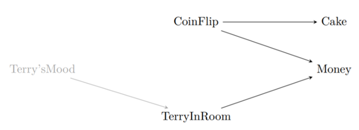
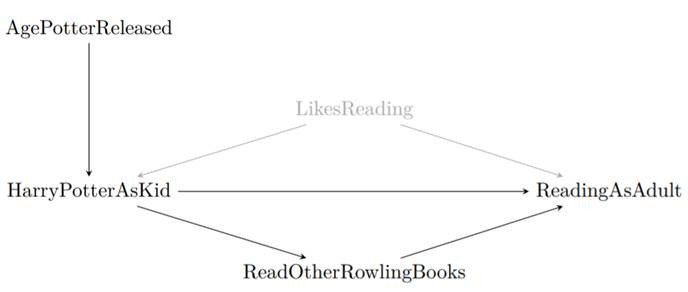
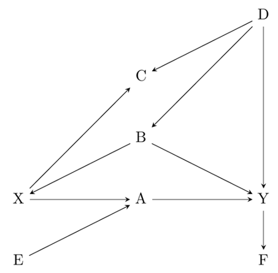
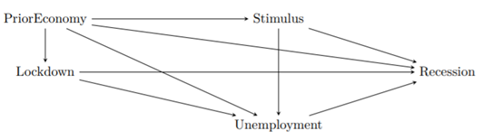

Below are the readings and assignments organized by module and class/date.

For every class you should:

- complete readings;
- submit answers to warmup questions on Canvas by 1 hour before class; and
- turn in homework assignments, printed and in-person to your TF/CA, by the beginning of class.

# **Module 1** --- An introduction to ‘Quantitative Social Science'

## Class 1 (09/02/2026)

### Readings

None

### Warmup questions:

None

### Homework questions:

None

## Class 2 (09/09/2026)

### Readings:

- Chapter 1: Overview from *Regression and Other Stories*
- Chapter 0: Introduction (Welcome & Note to Students) and Chapter 1: Designing Research from *The Effect*

### Warmup questions: Overview of statistics

1.  What are the three challenges of statistical inference?
2.  What are the key skills you should learn from the textbook?
3.  What is the URL of the website with data and examples from the textbook?

### Homework Questions:

1.  **Sketching a regression model and data** (Exercise 1.2 of *Regression and Other Stories*). Figure 1.1b of *Regression and Other Stories* shows data corresponding to the fitted line $y = 46.3 + 3.0x$ with residual standard deviation 3.9, and values of $x$ ranging roughly from 0 to 4%.

    - Sketch hypothetical data with the same range of $x$ but corresponding to the line $y = 30 + 10x$ with residual standard deviation 3.9.
    - Sketch hypothetical data with the same range of $x$ but corresponding to the line $y = 30 + 10x$ with residual standard deviation 10.

2.  **Goals of regression** (Exercise 1.3 of *Regression and Other Stories*). Download data on a topic of interest to you. Without graphing the data or performing any statistical analysis, discuss how you might use these data to:

    - fit a regression to estimate a relationship of interest;
    - use regression to adjust for differences between treatment and control groups; and
    - use a regression to make predictions.

3.  **Problems of statistics** (Exercise 1.4 of *Regression and Other Stories*). Give examples of applied statistics problems of interest to you with challenges in:

    - generalizing from sample to population;
    - generalizing from treatment to control group; and
    - generalizing from observed measurements to the underlying constructs of interest.

    Explain your answers.

# **Module 2** --- Critical thinking: the role of prediction and defining research questions

## Class 1 (09/14/2026)

### Readings:

- Appendices A.1-A.3: Computing in R from *Regression and Other Stories*; Ch.5.1-5.3 and 5.6 from [*R Graphics Cookbook*](https://r-graphics.org/CHAPTER-SCATTER.html) for Homework Question 2.

### Warmup Questions: sequences, sampling, looping, and vectors

For each question below, give R code.

1. 
    a. Generate and print the sequence (0, 0.2, 0.4, . . . , 20).
    b. Generate and print one random number, uniformly distributed between 0 and 10.
    c. Generate and print ten random numbers, uniformly distributed between 0 and 10.
2. Write a loop to generate and print 10 uniformly-distributed numbers, five times.
3.
    a. Create a vector $a$ that contains the names of four celebrities.
    b. Pick one of the names from vector $a$ with equal probability.
    c. Repeat with unequal probabilities (you choose) by setting up a vector $p$ that specifies the probabilities, and including it in your sample function.


### Homework Questions:

1.  **Goals of regression** (Exercise 1.5 of *Regression and Other Stories*). Give examples of applied statistics problems of interest to you in which the goals are:

    - forecasting/classification;
    - exploring associations;
    - extrapolation; and
    - causal inference.

    Explain your answers.

2.  **Causal inference** (Exercise 1.6 of *Regression and Other Stories*). Find a real-world example of interest with a treatment group, control group, a pre-treatment predictor, and a post-treatment predictor. Make a graph like Figure 1.8 using the data from this example.

3.  **Working through your own example** (Exercise 1.10 of *Regression and Other Stories*). Download or collect data on a topic of interest to you. You can use this example to work through the concepts and methods covered in the book, so the example should be worth your time and should have some complexity. This assignment continues throughout the book as the final exercise of each chapter. For this first exercise: 

    - Discuss your applied goals (e.g., what do you want to learn?) in studying this example, and
    - How the data can address these goals, and
    - How the data might be limited in addressing these goals.

## Class 2 (09/16/2026)

### Readings:

- Chapter 2: Research Questions from *The Effect*

### Warmup Questions:

1.  What is data mining useful for? What are its limitations?
2.  What is the difference between a theory, research question, and hypothesis?

### Homework Questions:

1.  Are each of the following questions a good research question? Explain your reasoning. If a question is not good, suggest ways to make it a better question if possible.

    - Do severe hurricanes cause psychological disorders in children in gestation during the hurricanes?
    - Are dogs the best pets?
    - Do organic labels on grocery-store items increase sales of those items?

2.  Think about a possible research question in your field of study (e.g., your major).

    - Can this question be answered? Is it feasible to answer it?
    - Does the question answer something about how the world works? If so, how?
    - Write down some hypotheses based on the question.
    - What kind of data needs to be collected to test the hypothesis?

3.  For each of the following theories and research questions, does the research question inform theory? That is, does answering the research question tell you something about the theory?

    - **Theory 1:** People donate to political campaigns largely because they want to defeat a political opponent, not because they like the candidate they are donating to. 
    - **Research question 1:** Do negative advertisements increase political campaign donations in U.S. Congressional races more than positive advertisements do?
    - **Theory 2:** Men have higher average salaries than women in the U.S. partially because employers discriminate against women in job interviews. 
    - **Research question 2:** Does the use of a gender-blind interview process, where hiring decisions and salary offers are made without knowing the employee's gender, shrink the salary gap between men and women?
    - **Theory 3:** Living in a rich country improves happiness. 
    - **Research question 3:** Do people who live in richer countries on average report higher happiness levels?
    - **Theory 4:** Many plants survive without eating because they collect energy from sunlight. 
    - **Research question 4:** Are plants that live underneath a thick canopy, where little light can get through, less healthy than those in a loose canopy?

# **Module 3** --- Back to the basics: data collection, description, and visualization

## Class 1 (09/21/2026)

### Readings:

- Chapter 2: Data and measurement from *Regression and Other Stories*

### Warmup Questions:

1.  In R, create data $x$ taking on the values 0, 0.5, 1, $\ldots$, 10; then create $y = \sqrt{x}$ and make a scatterplot of $y$ versus $x$.
2.  In R, create a plot of the line $y = \sqrt{x}$ for $x$ ranging from 0 to 10.

### Homework Questions:

1.  **Statistics as generalization** (Exercise 1.7 of *Regression and Other Stories*). Find a published paper on a topic of interest where you feel there has been insufficient attention to:

    - generalizing from sample to population;
    - generalizing from treatment to control group; and
    - generalizing from observed measurements to the underlying constructs of interest.

    Explain your answers.

2.  **Statistics as generalization** (Exercise 1.8 of *Regression and Other Stories*). Find a published paper on a topic of interest where you feel the following issues have been addressed well:

    - generalizing from sample to population;
    - generalizing from treatment to control group; and
    - generalizing from observed measurements to the underlying constructs of interest.

    Explain your answers.

3.  **Composite measures** (Exercise 2.1 of *Regression and Other Stories*). Following the example of the Human Development Index in Section 2.1, find a composite measure on a topic of interest to you. Track down its individual components and use scatterplots to understand how the measure works, as was done for that example in the book.

## Class 2 (09/23/2026)

### Readings:

- Chapter 3: Describing Variables and Chapter 4: Describing Relationships from *The Effect*

### Warmup Questions:

1.  What is a variable?

2.  Which of the following commonly represents the truth we are trying to estimate in statistics?

    - English/Latin letters like $x$ and $y$
    - Modifications of English letters like $\bar{x}$
    - Greek letters like $\mu$ and $\beta$
    - Modifications of Greek letters like $\hat{\beta}$

3.  Which term provides a description of the probability that each possible value of a variable will occur?

    - Variation
    - Distribution
    - Range
    - Mean

4.  What is a conditional distribution?

5.  Which term describes a measurement of how much two variables vary with each other?

    - Variance
    - Conditional mean
    - Covariance
    - Local mean

### Homework Questions:

1.  For each of the following variables, what type of variable is it: continuous, count, ordinal, categorical, or qualitative?

    - Age
    - Gender
    - The number of times that the President has tweeted in the past day
    - Income
    - Number of Instagram posts about statistics in the past month
    - The number of unemployment claims filed in the U.S. last week
    - The university or college that a student attends
    - A therapist's written assessment of a patient's symptoms of depression
    - Whether a soccer team is in its league's A division (highest), B division (next highest), or C division (lowest)

2.  Below is a frequency table depicting the salaries of political science professors employed at a university. The `Salary` column contains the salary, and the `Frequency` column contains the number of professors who earn the stated salary.

|    Salary | Frequency |
|----------:|----------:|
|  \$85,000 |         5 |
|  \$90,000 |         4 |
| \$100,000 |         1 |
| \$120,000 |         2 |
| \$125,000 |         3 |
| \$130,000 |         2 |

- Calculate the average salary earned by professors in the Economics department.
    - Calculate the median.
    - Calculate the minimum and maximum.
    - Calculate the interquartile range.

3.  The following graph represents the final-exam scores for 1,000 students who took an Introduction to Statistics course at a university.


Describe the distribution.

- Is there skewness to the data?
- Would the mean or the median be a better measure to describe the center of the distribution?
- What measure would you use to describe the variability in the distribution?

4.  The fictional table below depicts data collected from 3,000 university students on their classification (Freshman, Sophomore, Junior, Senior) and whether they receive financial aid.

| Financial aid | Freshman | Sophomore | Junior | Senior |
|:--------------|---------:|----------:|-------:|-------:|
| Yes           |      508 |       349 |    425 |    288 |
| No            |      371 |       337 |    384 |    338 |

- Calculate the probability of receiving financial aid given that a student is a Senior.
- Calculate the probability that a student is a Senior given that they receive financial aid.
- Calculate the probability of receiving financial aid given that a student is a Freshman.

# **Module 4** --- Nuts and bolts: a review of some math and probability

## Class 1 (09/28/2026)

### Readings:

- Chapter 3: Some basic methods in mathematics and probability from *Regression and Other Stories*

### Warmup Questions:

**Weighted averages**

In R, create three vectors each of length 10: the number 1 repeated 10 times; the numbers 1 to 10; and the sequence 1, 4, 9, $\ldots$, 100. Compute the following weighted averages of these three vectors. In each case, your output should be a vector of length 10.

1.  Weights 1/3, 1/3, 1/3
2.  Weights 1, 1, 1
3.  Weights 1, 2, 3
4.  Weights 0, 1, 2

### Homework Questions:

1.  **Data visualization** (Exercise 2.6 of *Regression and Other Stories*). Take data from some problem of interest to you and make several plots to highlight different aspects of the data, as was done in the baby-names example in Figures 2.6–2.8.

2.  **Reliability and validity** (Exercise 2.7 of *Regression and Other Stories*).

    - Give an example of measurements that have validity but not reliability.
    - Give an example of measurements that have reliability but not validity.

## Class 2 (09/30/2026)

### Readings:

- Appendices A.4-A.5: Computing from *Regression and Other Stories*

### Warmup Questions:

Express each line of code in story form. For example, the first could describe the number of shots made by a basketball player who takes 20 shots and has a 30% chance of making each shot. Run each line in R to check that your story interpretation makes sense.

``` r
#1a. 
rbinom(1, 20, 0.3)
#1b. 
rbinom(1, 20, 0.4)
#2a. 
rbinom(2, 20, c(0.3, 0.4))
#2b. 
rbinom(2, c(30, 20), c(0.3, 0.4))
```

### Homework Questions:

1.  **Weighted averages** (Exercise 3.1 of *Regression and Other Stories*). A survey is conducted in a city regarding support for increased property taxes to fund schools. Higher taxes are supported by 50% of respondents aged 18–29, 60% of respondents aged 30–44, 40% of respondents aged 45–64, and 30% of respondents aged 65 and up. Assume there is no nonresponse. The sample includes 200 respondents aged 18–29, 250 aged 30–44, 300 aged 45–64, and 250 aged 65+. Use the weighted-average formula to compute the proportion of respondents in the sample who support higher taxes.

2.  **Weighted averages** (Exercise 3.2 of *Regression and Other Stories*). Continuing the previous exercise, suppose you would like to estimate the proportion of all adults in the population who support higher taxes. Give a set of weights for the four age categories so that the estimated proportion who support higher taxes for all adults in the city is 40%.

3.  **Probability distributions** (Exercise 3.3 of *Regression and Other Stories*). Using R, graph probability densities for the normal distribution, plotting several curves corresponding to different choices of mean and standard deviation parameters.

4.  **Working through your own example** (Exercise 2.10 of *Regression and Other Stories*). Continuing the example from Exercise 1.10 (HW Q3, Module 1, Day 2): 

    - Graph your data and discuss issues of validity and reliability. 
    - How could you gather additional data, at least in theory, to address these issues?

# **Module 5** --- Bread and butter: statistical inference and identification

## Class 1 (10/05/2026)

### Readings:

- Chapter 4: Statistical inference from *Regression and Other Stories*

### Warmup Questions:

A sample of 𝑛 people are selected at random from a large population and are asked a question, to which $y$ reply Yes and $n - y$ reply No. For each example below, give a 95% interval for the proportion in the population who would answer Yes if asked.

1.  $n = 1500$, $y = 750$

2.  $n = 1500$, $y = 900$

3.  $n = 100~000$, $y = 51~000$

4.  $n = 10$, $y = 6$

5.  $n = 3$, $y = 3$


### Homework Questions:

1.  **Probability distributions** (Exercise 3.5 of *Regression and Other Stories*). Using a bar plot in R, graph the binomial distribution with $n = 20$ and $p = 0.3$.

2.  **Comparison of proportions** (Exercise 4.1 of *Regression and Other Stories*). A randomized experiment is performed within a survey. 1000 people are contacted. Half the people contacted are promised a $5 incentive to participate, and half are not promised an incentive. The result is a 50% response rate among the treated group and 40% response rate among the control group. Give an estimate and standard error of the average treatment effect.

3.  **Choosing sample size** (Exercise 4.2 of *Regression and Other Stories*). You are designing a survey to estimate the gender gap: the difference in support for a candidate among men and women. Assuming the respondents are a simple random sample of the voting population, how many people do you need to poll so that the standard error is less than 5 percentage points?

4.  **Comparison of proportions** (Exercise 4.3 of *Regression and Other Stories*). You want to gather data to determine which of two students is a better basketball shooter. One of them shoots with 30% accuracy and the other is a 40% shooter. Each student takes 20 shots and you then compare their shooting percentages. What is the probability that the better shooter makes more shots in this small experiment?

5.  **Designing an experiment** (Exercise 4.4 of *Regression and Other Stories*). You want to gather data to determine which of two students is a better basketball shooter. You plan to have each student take $N$ shots and then compare their shooting percentages. Roughly how large does $N$ have to be for you to have a good chance of distinguishing a 30% shooter from a 40% shooter?


## Class 2 (10/07/2026)

### Readings:

- Chapter 5: Identification from *The Effect*

### Warmup Questions:


1.  Think about the last time you sat down in a chair (perhaps right now). When you did that, you probably predicted you would observe that you would end up sitting in the chair, rather than passing through it or the chair breaking. List three assumptions you made about the data generating process when you made that prediction.

2.  Which of the following is the best definition of the term identified as in "this variation has identified the effect we're interested in"?

    - We've generated the data by conducting a controlled experiment in which treatment is randomly assigned.
    - In the data generating process, the only reason why we see variation in the outcome variable is because of the treatment variable.
    - The relationship we are looking at in the data actually tests a hypothesis.
    - In the variation we use, there's no reason we'd see any relationship at all except for the effect we're interested in.
 
3.  Which of the following terms describe how a variable changes from observation to observation?

    - Data-generating process
    - Variation
    - Raw data
    - Determinants
  
4.  Why is a variable that causes both the "treatment" and "outcome" variables especially concerning for identification? You may want to use the phrase "alternate explanation" in your answer.


### Homework Questions:


1.  Go to your favorite news source and find an article that describes the results of a new empirical study. Describe what you think are some features of the data generating process. What are some ways to explain their result other than the interpretation they had? Did the study (as described in the article) have ways of blocking out the alternate explanation you thought of?

2.  You read about a new study with the headline "eating caviar linked to longer lifespan." The study's research question is "does eating caviar make you live longer?" In the study's data, they find that people who eat caviar have, on average, longer lifespans than people who don't. 

    - What are some alternate explanations for this relationship? 
    - What sort of variation would identify the answer to the research question? 
    - Give one suggestion for how the study authors might isolate variation that would identify the answer to the research question

3.  For each of the following news headlines, assume that the underlying data actually only shows a correlation between the two variables mentioned. Give an alternate explanation for the correlation other than the causal relationship implied by the headline.

    - "As stock market drops, presidential approval ratings decline."
    - "Dates are announced for the downtown summer concert series, driving up sales at downtown restaurants." 
    - "Unsanitary? Hospital visits linked to 20% increased risk of disease." 
    - "Dress for success! Every CEO follows this office-wear rule."
  
4.  Shoe company Crikey claims that people who wear their fancy and expensive professional running-shoe Cool Mistrunner brand run 4 to 5% faster than if they wore an average shoe.

    - In a few sentences, describe the data-generating process (you will probably leave some things out, that's okay).
    - What are possible alternative explanations for this claim, aside from the shoe making the person run faster?
    - In running their study, the researchers accounted for some alternative explanations, including: gender, enthusiasm for running, and whether runners have participated in marathons and/or half marathons. Think of an alternative explanation not on this list. What is the implication of not accounting for this alternative explanation?


# **Module 6** --- The city on the hill: simulation(s) and causal diagrams

## Class 1 (10/14/2026)

### Readings:

- Chapter 5: Simulation and Appendices A.6-A.7: Computing in R from *Regression and Other Stories*

### Warmup Questions:

Write R code to do the following:

1.  Simulate a random number representing the number of shots that a basketball player makes in 10 tries, if the results of the shots are independent and she has a 40% chance of making each shot.

2.  Simulate a random number representing the number of shots that a basketball player makes in 10 tries, if the results of the shots are independent and her chance of making a shot is 10% for the first shot, 20% for the second shot, 30% for the third, etc.

3.  Suppose the distance that you throw a ball has a normal distribution with mean 20 meters and standard deviation 5 meters. Simulate the results of three independent throws.

4.  100 people are asked how many pets they have. The respondents are randomly sampled from a population where 30% of the people have no pets, 40% have one pet, 20% have two pets, and 10% have three pets. Simulate the 100 responses and compute the average number of pets among the respondents.

5.  100 students are randomly divided into two groups: 50 take a new experimental math course and 50 take the usual class. They are then all given a test. Suppose that test scores are normally distributed with mean 60 and standard deviation 10 after taking the usual class, or mean 70 and standard deviation 15 after taking the experimental course. Simulate the 100 test scores from the experiment and compute the estimated treatment effect and standard error.


### Homework Questions:

1.  **Inference from a proportion with $y = 0$** (Exercise 4.7 of *Regression and Other Stories*). Out of a random sample of 50 Americans, zero report having ever held political office. From this information, give a 95% confidence interval for the proportion of Americans who have ever held political office.

2.  **Discrete probability simulation** (Exercise 5.1 of *Regression and Other Stories*). Suppose that a basketball player has a 60% chance of making a shot, and he keeps taking shots until he misses two in a row. Also assume his shots are independent (so that each shot has 60% probability of success, no matter what happened before).

    - Write an R function to simulate this process.
    - Put the R function in a loop to simulate the process 1000 times. Use the simulation to estimate the mean and standard deviation of the total number of shots that the player will take, and plot a histogram representing the distribution of this random variable.
    - Using your simulations, make a scatterplot of the number of shots the player will take and the proportion of shots that are successes.


## Class 2 (10/19/2026)

### Readings:

- Chapter 6: Causal Diagrams and Chapter 7: Drawing Causal Diagrams from *The Effect*

### Warmup Questions:

1.  Which of the following describes a representation of a data generating process (DGP) including variables in that DGP and the causal relationships between them?

    - Causality
    - Direct and indirect effect
    - Latent variable
    - Causal diagram
    
2.  Consider the below diagram, which reproduces Figure 6.3 In this diagram...

    - Which variables have a direct effect on Money?
    - Which variables have an indirect effect on Money?




    
3.  You are making a simplified causal diagram to represent the data generating process of viewership for a TV show. Which of the following is true?

    - The diagram should include a variable for "number of celebrities in the cast"
    - The diagram should contain one variable for "show airs in the evening" and another for "show doesn't air in the evening"
    - The diagram should not contain a variable for "show budget" because budgets are often secret and the researcher can't measure them
    - The diagram should contain the variable "review score in the Jefferson Weekly," which is the newspaper published by the students at Jefferson High School, with a readership of about 120 people.
    
4.  Define causality. In a few sentences, why is causality interesting and important?


### Homework Questions:

1.  In a conversation with your friend, you mention a study you read that found that being tall causally makes you more likely to earn above $100,000 per year. Your friend says the study must be wrong, since they know several tall people who make much less than that, and several short people who do earn that much. Does your friend's reasoning make sense or not, and why?

2.  You are interested in the question "Does reading Harry Potter as a child make you read more as an adult?" and draw the diagram below.

    - What direct effects should be included when trying to answer your research question of interest?
    - What indirect effects should be included when trying to answer your research question of interest?
    - What is a likely alternative explanation of why we might see a relationship between reading Harry Potter and reading more as an adult?




3.  The figure in Question 2 has LikesReading included as an unobserved variable. In a few sentences each, explain:

    - Why do we bother to include variables on our diagrams if we can't observe them?
    - Why might we think that LikesReading is an unobserved or latent variable?

5.  Draw a causal diagram for the research question "do long shift hours make doctors give lower-quality care?" that incorporates the following features (and only the following features):

    - Long shift hours affect both how tired doctors are, and how much experience they have, both of which affect the quality of care
    - How long shifts are is often decided by the hospital the doctor works at. There are plenty of other things about a given hospital that also affect the quality of care, like its funding level, how crowded it is, and so on
    - New policies that reduce shift times may be implemented at the same time (with the timing determined by some unobservable change in policy preferences) as other policies that also attempt to improve the quality of care


# **Module 7** --- Laying the foundation: background on regression modeling and ‘doors' in causal inference

## Class 1 (10/21/2026)

### Readings:

- Chapter 6: Background on regression modeling from *Regression and Other Stories*

### Warmup Questions:

1.  Fit a regression to fake data

    - Write R code to simulate 100 data points from a linear model with intercept 1, slope 2, and residual standard deviation 3, where the predictors are sampled at random uniformly from the range (0, 4). Fit and print a linear regression to these data, and report whether the true values of the intercept and slope fall within 1 standard error of the true parameter values.

2.  Make a plot with the simulated data and the fitted regression line, including the formula for the fitted line as in Figure 6.1 of Regression and Other Stories.


### Homework Questions:

1.	**Binomial distribution** (Exercise 5.3 of *Regression and Other Stories*). A player takes 10 basketball shots, with a 40% probability of making each shot. Assume the outcomes of the shots are independent.

    - Write a line of R code to compute the probability that the player makes exactly 3 of the 10 shots.
    - Write an R function to simulate the 10 shots. Loop this function 10 000 times and check that your simulated probability of making exactly 3 shots is close to the exact probability computed above.
    
2.  **Data and fitted regression line** (Exercise 6.1 of *Regression and Other Stories*). A teacher in a class of 50 students gives a midterm exam with possible scores ranging from 0 to 50 and a final exam with possible scores ranging from 0 to 100. A linear regression is fit, yielding the estimate $y = 30 + 1.2 \times x$ with residual standard deviation 10. Sketch (by hand, not using the computer) the regression line, along with hypothetical data that could yield this fit.

3.  **Programming fake-data simulation** (Exercise 6.2 of *Regression and Other Stories*). Write an R function to: 

    - simulate $n$ data points from the model, $y = a + bx + \text{error}$, with data points $x$ uniformly sampled from the range (0, 100) and with errors drawn independently from the normal distribution with mean 0 and standard deviation $\sigma$; 
    - fit a linear regression to the simulated data; and 
    - make a scatterplot of the data and fitted regression line. Your function should take as arguments, $a$, $b$, $n$, $\sigma$, and it should return the data, print out the fitted regression, and make the plot. Check your function by trying it out on some values of $a$, $b$, $n$, $\sigma$.


## Class 2 (10/26/2026)

### Readings:

- Chapter 8: Causal Paths and Closing Back Doors and Chapter 9: Finding Front Doors from *The Effect*

### Warmup Questions:

1.  Which of the following describes a causal path where all the arrows point away from the treatment?

    - Open Path
    - Closed Path
    - Front Door Path
    - Back Door Path
    
2.  Which of the following describes when randomization of treatment occurs without a researcher controlling the randomization?

    - Exogenous variation
    - Natural experiment
    - Instrumental variable
    - Randomized experiment
    
3.  Provide an example of a research question that is causal in nature but cannot be feasibly answered by a randomized experiment. Explain your reasoning.

4.  Define the concept of exogenous variation.


### Homework Questions:

1.  Consider the below generic causal diagram.

    - List every path from X to Y.
    - Which of the paths are front-door paths?
    - Which of the paths are open back-door paths?
    - What variables must be controlled for in order to identify the effect of X on Y? (only list what must be controlled for, not anything that additionally could be controlled for).



    


2.  Consider the research question: Does having higher income cause better health?

    - Draw a causal diagram depicting the data generating process for this relationship with 5-10 variables on it.
    - Identify the Front Door paths.
    - Identify the Back Door paths.
    - Identify the paths that represent direct effects.
    - Identify the Good Paths and the Bad Paths.


3.  Consider the figure below, which depicts the relationship between a pandemic-related lockdown and an economic recession. The research question of interest is: Does a pandemic-related lockdown cause recession?

    - Write down all the paths in the diagram from Lockdown to Recession. To make our lives simpler (there are a lot of paths in this diagram), ignore any path that goes through Stimulus.
    - List all of the paths that are Front Door Paths.
    - What would happen if we controlled for unemployment?
    - Is it possible to measure each of the variables adequately?
    - Can you think of any variables and paths not depicted in the diagram that may be relevant to identify the answer to the research question? List at least one and no more than three.



    

4.  Describe the four major differences between randomized experiments and natural experiments discussed in the chapter. As a bonus, there's a fifth difference described in the chapter having to do with sample size and representativeness.

# **Module 8** --- $y = mx + b$: regression with a single predictor and causal treatment effects

## Class 1 (10/28/2026)

### Readings:

- Chapter 7: Linear regression with a single predictor from *Regression and Other Stories*

### Warmup Questions:

Suppose you have a vector test_scores of exam grades for a class of students, and a vector level taking on the values 1 for undergraduate and 2 for graduate students.

1.  Explain why the estimated coefficient in the linear regression test_scores ~ 1 gives the average grade in the class. Give R code to perform this regression and extract the coefficient estimate.

2.  Write the code for the linear regression that gives the difference between the average grades for graduate and undergraduates in the class.


### Homework Questions:

1.  Simulate 100 data points with measurements 𝑥 and y as follows. Let 𝑥 be uniformly distributed between 0 and 10, and simulate y from the model, $y = a + bx + \text{error}$, where $a = 2$, $b = 0.5$, and the error is normally distributed with mean 0 and standard deviation $\sigma = 2$. Give your code.

2.  Use `lm()` to fit a linear regression of $y$ on $x$. Display the result. Discuss the discrepancies between your estimates of $a$, $b$, $\sigma$ and the true values, in comparison to the standard errors from the regression. Give your code as well as your R output.

3.  Plot the data and the fitted regression line. Give your code as well as your graph.

4.  Now suppose $x$ is measured with error: Create a new variable `x_obs` by taking $x$ and adding normally distributed errors with mean 0 and standard deviation 5. Now fit the linear regression predicting $y$ from `x_obs`. How do the coefficient estimates compare to the result from regressing $y$ on $x$ as you did earlier?


## Class 2 (11/02/2026)

### Readings:

- Chapter 10: Treatment Effects from *The Effect*

### Warmup Questions:

1.  Define in your own words (i.e., don't just copy down what's written in the glossary) each of the following terms:

    - Conditional average treatment effect
    - Average treatment on the treated
    - Average treatment on the untreated

2.  Provide an example of a treatment effect that you would expect to be highly heterogeneous, and explain why you think it is likely to be heterogeneous

3.  Which of the following describes the average treatment effect of assigning treatment, whether or not treatment is actually received?

    - Local average treatment effect
    - Average treatment on the treated
    - Intent-to-treat
    - Variance-weighted average treatment effect


### Homework Questions:

1.  Consider the data in the table below that shows the hypothetical treatment effect of cognitive behavioral therapy on depression for six participants. For the sake of this example, the six participants represent the population of interest.

    - What is the overall average treatment effect for the population?
    - What is the average treatment effect for Women?
    - If nearly all Non-binary people get treated, and about half of all Women get treated, and we control for the differences between Women and Non-binary people, what kind of treatment effect average will we get, and what can we say about the numerical estimate we'll get?
    - If we assume that, in the absence of treatment, everyone would have had the same outcome, and also only teenagers (19 or younger) ever receive treatment, and we compare treated people to control people, what kind of treatment effect average will we get, and what can we say about the numerical estimate we'll get?

| Case | Age | Gender     | Effect |
|:-----|:----|:-----------|:-------|
| A    | 15  | Man        | 7      |
| B    | 40  | Woman      | 3      |
| C    | 30  | Woman      | 7      |
| D    | 20  | Non-binary | 8      |
| E    | 15  | Man        | 7      |
| F    | 25  | Woman      | 4      |
    
    
2.  On weighted treatment effects: 

    - Describe what a variance-weighted treatment effect is
    - Describe what a distribution-weighted treatment effect is 
    - Under what conditions/research designs would we get each of these?
    
3.  Suppose you are conducting an experiment to see whether pricing cookies at $1.99 versus $2 affects the decision to purchase the cookies. The population of interest is all adults in the United States. You recruit people from your university to participate and randomize them to either see cookies priced as $1.99 or $2, then write down whether they purchased cookies. What kind of average treatment effect can you identify from this experiment?

4.  For each of the following identification strategies, what kind of treatment effect(s) is most likely to be identified? 

    - A randomized experiment using a representative sample 
    - True randomization within only a certain demographic group
    - Closing back door paths connected to variation in treatment 
    - Isolating the part of the variation in treatment variable that is driven by an exogenous variable 
    - The control group is comparable to the treatment group, but treatment effects may be different across these groups
    
5.	Give an example where the average treatment effect on the treated would be more useful to consider than the overall average treatment effect, and explain why.

# **Module 9** --- $y = \beta_1x_1 + \beta_2x_2 + \beta_2x_3$...: linear regression with multiple predictors

## Class 1 (11/04/2026)

### Readings:

- Chapter 10: Linear regression with multiple predictors from *Regression and Other Stories*

### Warmup Questions:

1.  Without using the computer, figure out the slope, 𝑏, of the least-squares line, $y= a + bx$, for the three points $(x, y) = (0, 0),~(1, 2),~(2, 2)$.

2.  Without using the computer, figure out the intercept, $a$, of this fitted line.

3.  Suppose you fit a linear regression to world population during the twentieth century, using the following data points: 1.5 billion in 1900, 2.5 billion in 1950, 6 billion in 2000. Without using the computer, figure out the least-squares line, $y = a + bx$, for these three data points.


### Homework Questions:

1.  You've generated some random data  $X$, $Y$, and $\epsilon$ where you randomly generated $X$ and $\epsilon$ as normally distributed data, and then created $Y$ using the formula $Y = 2 + 3X + \epsilon$. You look at some of the random data you generated, and see an observation with $X = 2$ and $Y = 9$. Let's call that Observation A.

    - What is the *error* for Observation A?
    - You estimate the regression $Y = \beta_0 + \beta_1X + \epsilon$ using the data you generated and get the estimates $\hat{\beta}_0 = 1.9$, $\hat{\beta}_1 = 3.1$. What is the *residual* for Observation A?
    
2.  You use regression to estimate the equation $Y = \beta_0 + \beta_1X + \epsilon$ and get an estimate of $\hat{\beta}_1 = 3$ and the standard error $s.e.(\hat{\beta}_1) = 1.3$.

    - Interpret, in a sentence, the coefficient $\hat{\beta}_1$.
    - Calculate whether $\hat{\beta}_1$ is statistically significantly different from 0 at the 95% level. (more technical detail you may not need: do a two-sided test, and assume the sample size is effectively infinite)
    - Whatever your answer to part b, what does it mean to say that this coefficient is statistically significantly different from 0?
    
3. Consider the below conventional OLS regression table, which uses data from 1987 on how many hours women work in paid jobs. In the table, hours worked is predicted using the number of children under the age of 5 in the household and the number of years of education the woman has.

    - How many additional hours worked is associated with a one-unit increase of years of education when controlling for number of children?
    - What is the standard error on the "children under 5" coefficient when not controlling for years of education?
    - In the third model, what is the predicted number of hours worked for a woman with zero children and zero years of education?
    - How many observations are used in each of the three regressions?
    - Is the coefficient on "children under 5" statistically significantly different from 0 at the 95% level?


|                    | Annual Hours Worked (1) | Annual Hours Worked (2) | Annual Hours Worked (3) |
| :----------------- | :------------------     | :------------------     | :------------------     |
| (Intercept)        | 230.018\*\*\*           | 1256.671\*\*\*          | 306.553\*\*\*           |
|                    | (79.671)                | (18.046)                | (77.975)                |
| Years of Education | 72.130\*\*\*            |                         | 76.185\*\*\*            |
|                    | (6.232)                 |                         | (6.09)                  |
| Children under 5   |                         | -238.853\*\*\*          | -251.181\*\*\*          |
|                    |                         | (19.693)                | (19.28)                 |
| Num. Obs.          | 3382                    | 3382                    | 3382                    |
| R2                 | 0.038                   | 0.042                   | 0.084                   |


## Class 2 (11/09/2026)

### Readings:

- Chapter 11: Causality with less modeling and Chapter 12: Opening the Toolbox from *The Effect*

### Warmup Questions:

1.  What does it mean to say that the effect of financial deregulation on the rate at which firms go bankrupt is "bounded from above" at 2 percentage points?

    - The effect is 2 percentage points, and it's a positive effect
    - The effect is 2 percentage points, and it's a negative effect
    - The effect is at least as large as 2 percentage points
    - The effect is no larger than 2 percentage points
    - If we're willing to make an additional, stronger set of assumptions, the effect would be larger than 2 percentage points, but without those assumptions it's bounded to be lower. 

2.  Suppose that you are analyzing the effect of universities and colleges opening during a pandemic on increase in the number of positive cases. Name one strategy that you can use to avoid having to collect data on all types of campus characteristic variables that are constant over time that you may have to control for in your analysis.

3.  Describe partial identification in your own words.


### Homework Questions:

1.  Intuitively, why would a method that isolates front doors allow you to ignore back doors related to unmeasured variables?

2.  On robustness tests:

    - What are robustness tests?
    - What is the purpose of conducting a robustness test?
    - What are placebo tests?
    
3.  Suppose you want to study the effect of attending tutoring sessions on grade point averages (GPA). List at least five variables that impact both attendance of tutoring sessions and students' GPA. Is it feasible to measure and control for all of the variables?

4.  Pick any causal diagram from the book (*The Effect*) other than Figure 11.2.

    - Reproduce that diagram here.
    - Select two variables on the diagram without a direct link between them (i.e. no single arrow straight from one of them to the other).
    - What variables would you need to control for that will eliminate any relationship between the two variables (you might not need any).
    - If you looked at the relationship between your two variables from part b, while controlling for the variables from part c, and you got a nonzero result, what would you conclude?


# **Module 10** --- But what about causality?: experiments and selection on observables

## Class 1 (11/11/2026)

### Readings:

- Chapter 18: Causal inference and randomized experiments from *Regression and Other Stories*

### Warmup Questions:

1. Consider the following hypothetical table of pre-treatment predictor, treatment, and potential outcomes ($y_{0i}$, $y_{1i}$).

    - What is the treatment effect for Audrey?
    - What is the sample average treatment effect?
    - What is the estimated average treatment effect, if it is estimated by a simple regression of the observed outcome, $y$, on the treatment indicator, $z$?


| Unit \(i\) | Age, \(x_i\) | Treatment, \(z_i\) |   \(y_{0i}\)       | \(y_{1i}\)         |
| :--------- | -----------: | -----------------: | -----------------: | ---------------:   |
| Audrey     | 40           | 0                  | 140                | 135                |
| Anna       | 45           | 1                  | 140                | 135                |
| Bob        | 50           | 1                  | 150                | 140                |
| Bill       | 55           | 0                  | 150                | 140                |
| Caitlin    | 60           | 0                  | 160                | 155                |
| Cara       | 65           | 0                  | 160                | 155                |
| Dave       | 70           | 1                  | 170                | 160                |
| Doug       | 75           | 1                  | 170                | 160                |

### Homework Questions:

1.  **Designing an experiment** (Exercise 18.1 of *Regression and Other Stories*). Suppose you are interested in the effect of the presence of vending machines in schools on childhood obesity. What controlled experiment would you want to do (in a world without ethical, logistical, or financial constraints) to evaluate this question? Go through the entire design process and justify each decision in detail

    - Research Question
    - Sample
    - Experimental Design
    - Analysis
    - Generalization
    

2.  **Designing an experiment with ethical constraints** (Exercise 18.2 of *Regression and Other Stories*). Suppose you are interested in the effect of smoking on lung cancer. What controlled experiment could you plausibly perform (in the real world) to evaluate this effect? Go through the entire design process and justify each decision in detail

    - Research Question
    - Sample
    - Experimental Design
    - Analysis
    - Generalization


## Class 2 (11/16/2026)

### Readings:

- Sections 20.1, 20.2, 20.3 from Chapter 20: Observational studies with measured confounders from *Regression and Other Stories*
- Sections 13.1, 13.2.0, 13.2.1, 13.4.1, 13.4.2, 13.4.3 from Chapter 13: Regression from *The Effect*

### Warmup Questions:

Suppose you are conducting an observational study comparing two different approaches to counseling of caregivers of family members. The outcome is a mental health survey of caregivers and the study also includes three pre-treatment predictors on the caregivers: age, sex, and a measure of life satisfaction.

1.  How could you obtain estimates of the effect among all the caregivers in the study, the effect among caregivers with pre-treatment life satisfaction that was lower than average, and among caregivers with pre-treatment life satisfaction that was higher than average?

2.  You are concerned that your study is not representative of the general population of caregivers. How can you estimate the population average treatment effect using the data from your study?

### Homework Questions:

1.  **Messy randomization** (Exercise 19.8 of *Regression and Other Stories*). Download this data called [`cows.dat`](https://github.com/avehtari/ROS-Examples/tree/master/Cows/).  from an agricultural experiment that was conducted on 50 cows to estimate the effect of a feed additive on six outcomes related to the amount of milk fat produced by each cow.

  Four diets (treatments) were considered, corresponding to different levels of the additive, and three variables were recorded before treatment assignment: lactation number (seasons of lactation), age, and initial weight of the cow.

  Cows were initially assigned to treatments completely at random, and then the distributions of the three pre-treatment predictors were checked for balance across the treatment groups; several randomizations were tried, and the one that produced the "best" balance with respect to the three covariates was chosen. The treatment depends only on fully observed covariates and not on unrecorded variables such as the physical appearances of the cows or the times at which the cows entered the study, because the decisions of whether to re-randomize are not explained.

  We shall consider different estimates of the effect of the additive on the mean daily milk fat produced.
  
  - Consider the simple regression of mean daily milk fat on the level of additive. Compute the estimated treatment effect and standard error, and explain why this is not a completely appropriate analysis given the randomization used.
    
  - Add more predictors to the model. Explain your choice of which variables to include. Compare your estimated treatment effect to the result from above.
    
  - Repeat step 2, this time considering additive level as a categorical predictor with four levels. Make a plot showing the estimate (and standard error) of the treatment effect at each level, and also showing the inference from the model fit in step 2.
    

2.  **Causal inference based on data from individual choices** (Exercise 19.9 of *Regression and Other Stories*). Our lives involve tradeoffs between monetary cost and physical risk, in decisions ranging from how large a car to drive, to choices of health care, to purchases of safety equipment. Economists have estimated how people implicitly trade off dollars and danger by comparing choices of jobs that are similar in many ways but have different risks and salaries. This can be approximated by fitting regression models predicting salary given the probability of death on the job (and other characteristics of the job). The idea is that a riskier job should be compensated with a higher salary, with the slope of the regression line corresponding to the "value of a statistical life."

    - Set up this problem as an individual choice model, as in Section 15.7 of Regression and Other Stories. What are an individual's options, value function, and parameters?
    - Discuss the assumptions involved in assigning a causal interpretation to these regression models.

# **Module 11** --- Rubber meets the road: using regression for experiments and matching

## Class 1 (11/18/2026)

### Readings:

- Chapter 19: Causal inference using regression on the treatment variable from *Regression and Other Stories*

### Warmup Questions:

Consider the following hypothetical scenario of pre-treatment measurements and potential outcomes:

| Unit      | \(x\) | \(z\) | \(y_0\) | \(y_1\) |
| :-------- | ----: | :---: | ------: | ------: |
| Aurelia   | 11    | ?     | 13      | 17      |
| Bora      | 14    | ?     | 14      | 16      |
| Chen      | 13    | ?     | 17      | 18      |
| D'Angelo  | 14    | ?     | 19      | 19      |
| Eddie     | 9     | ?     | 14      | 13      |
| Farah     | 11    | ?     | 9       | 10      |
| Goldie    | 7     | ?     | 13      | 13      |
| Harpreet  | 10    | ?     | 15      | 19      |

1.  Use R to randomly assign treatment to four out of the eight people.

2.  Given your treatment assignment, calculate the gain score $g_1 = y_i - x_i$ for each person $i$.

3.  Given the data you would see after your treatment assignment, estimate the treatment effect in two ways, first by regressing $y$ on $z$, then by regressing $y$ on $z$ and $x$.

### Homework Questions:

1. **Average treatment effects** (Exercise 18.4 of *Regression and Other Stories*). The following table displays a hypothetical experiment on 8 people. Each row of the table gives a participant and her pre-treatment predictor $x$, treatment indicator $z$, and potential
outcomes $y_0$ and $y_1$.

    - Give the average treatment effect in the population, the average treatment effect among the treated, and the estimated treatment effect based on a simple comparison of treatment and control.
    
    - Simulate a new completely randomized experiment on these 8 people; that is, resample $z$ at random with the constraint that equal numbers get the treatment and the control. Report your new randomization and give the corresponding answers for step 1.


| Unit | \(x\) | \(z\) | \(y_0\) | \(y_1\) |
| :--- | ----: | ----: | ------: | ------: |
| Anna | 3     | 0     | 5       | 5       |
| Beth | 5     | 0     | 8       | 10      |
| Cari | 2     | 1     | 5       | 3       |
| Dora | 8     | 0     | 12      | 13      |
| Edna | 5     | 0     | 4       | 2       |
| Fala | 10    | 1     | 8       | 9       |
| Geri | 2     | 1     | 4       | 1       |
| Hana | 11    | 1     | 9       | 13      |

2.  **Potential outcomes** (Exercise 18.5 of *Regression and Other Stories*) The following tables displays a hypothetical experiment on 2400 people. Each row specifies a category of person, as defined by a pre-treatment predictor $x$, treatment indicator $z$, and potential outcomes $y_0$, $y_1$. For simplicity, we assume unrealistically that all the people in this experiment fit into these eight categories.

| Category | # people in category | \(x\) | \(z\) | \(y_0\) | \(y_1\) |
| -------: | -------------------: | ----: | ----: | ------: | ------: |
| 1        | 300                  | 0     | 0     | 4       | 6       |
| 2        | 300                  | 1     | 0     | 4       | 6       |
| 3        | 500                  | 0     | 1     | 4       | 6       |
| 4        | 500                  | 1     | 1     | 4       | 6       |
| 5        | 200                  | 0     | 0     | 10      | 12      |
| 6        | 200                  | 1     | 0     | 10      | 12      |
| 7        | 200                  | 0     | 1     | 10      | 12      |
| 8        | 200                  | 1     | 1     | 10      | 12      |

In making the table, we are assuming omniscience, so that both y0 and y1 are known for all observations. But the (non-omniscient) investigator would only observe $x$, $z$, and $y_z$ for each unit. For example, a person in category 1 would have $x$ = 0, $z$ = 0, $y$ = 4, and a person in category 3 would have $x$ = 0, $z$ = 1, $y$ = 6.

- What is the average treatment effect in this population of 2400 people?
- Another summary is the mean of y for those who received the treatment minus the mean of y for those who did not. What is the relation between this summary and the average treatment effect (ATE)?
- Is it plausible to believe that these data came from a completely randomized experiment? Defend your answer.
- For these data, is it plausible to believe that treatments were assigned using randomized blocks conditional on given 𝑥? Defend your answer.


## Class 2 (11/23/2026)

### Readings:

- Sections 20.4, 20.5, 20.7 from Chapter 20: Observational studies with measured confounders from *Regression and Other Stories*
- Sections 14.1, 14.2, 14.3, 14.5, 14.6 from Chapter 14: Matching from *The Effect*

### Warmup Questions:

For each of the following descriptions of matching on the variable $X$, determine whether this is describing: *one-to-one distance matching, k-nearest-neighbor distance matching, kernel matching, or propensity score matching* (hint: it's one of each).

1.  The treated observation has $X = 5$. For each control observation, $X-5$ is calculated, with the result run through a weighting function. The resulting weight is applied to that observation.

2.  The treated observation has $X = 5$. Among the control observations, the nearest values are $X = 4$, $X = 5.2$ and $X = 5.9$. The observations with  and  are chosen as a control, since they're the two closest.

3.  The treated observation has $X = 5$. You estimate a model that suggests that observations with $X = 5$ have a .6 chance of being treated. You similarly calculate the chance of treatment for each control observation, and use those calculated probabilities to create a weight for each observation.

4.  The treated observation has $X = 5$. Among the control observations, the observation with $X = 5.1$ is closest to that, and so is selected as a control.


### Homework Questions:

[TBD]


# **Module 12** --- All by design: design-based causal inference

## Class 1 (11/30/2026)

### Readings:

- Section 18.1 from Chapter 18: Difference-in-Differences from *The Effect*
- [Card & Krueger (1994)](jstor.org/stable/2118030)

### Warmup Questions:

[TBD]

### Homework Questions:

[TBD]

## Class 2 (11/02/2026)

### Readings:

- Section 20.1 from Chapter 20: Regression Discontinuity from *The Effect*
- [Hoekstra (2009)](https://hollis.harvard.edu/permalink/01HVD_INST/726dgh/cdi_mit_journals_restv91i4_304162_2021_11_09_zip_rest_91_4_717)

### Warmup Questions:

[TBD]

### Homework Questions:

[TBD]
