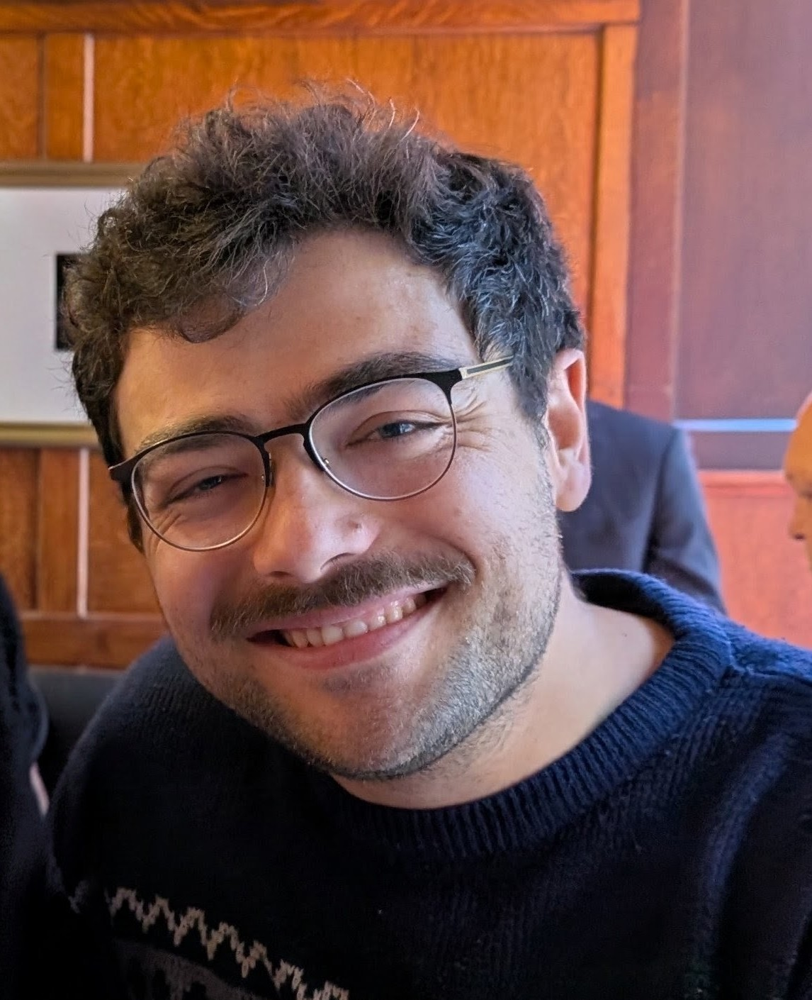

# Course Staff


```{r packages-data, include=FALSE} 
library(tidyverse)
library(knitr)
library(kableExtra)
library(lubridate)
library(glue)

staff <- read_csv("class_data/staff.csv", show_col_types = FALSE) 
```


## Head Instructor {.staff}

::: {.grid .d-flex .align-items-center}

::: {.g-col-3}



 
:::

::: {.g-col-9}

    
  
-  &nbsp; []()
-  &nbsp; 
-  &nbsp; <a href="mailto:"></a>
-  &nbsp; [Schedule an appointment]()

::: 

:::

  

  
 
```{r build-table, echo=FALSE, results="asis"}


positions <- c("Head Teaching Fellow", "Teaching Fellows", "Course Assistants")


for (i in positions) {

  
  cat(
    glue("## [i] {.staff}", , .open = "[", .close = "]")    
  )


  this_pos <- staff |>
    filter(position == i)

  for (j in seq_len(nrow(this_pos))) {
    this_name <- this_pos$name[j]
    this_email <- this_pos$email[j]
    this_website <- this_pos$website[j]
  
    this_pic <- ifelse(!is.na(this_pos$photo[j]), this_pos$photo[j], "eraserhead.jpg")
    
    

    cat(
      "\n\n::: {.grid .d-flex .align-items-center}\n\n::: {.g-col-3}\n\n",
      glue("\n\n"),
      "\n\n:::\n\n::: {.g-col-9}\n\n",
      glue("-  &nbsp; [this_name]\n\n", .open = "[", .close = "]")    
    )

    if (!is.na(this_email)) {
      cat(
        glue("-  &nbsp; <a href=\"mailto:[this_email]\">[this_email]</a>\n\n",
           , .open = "[", .close = "]")
      )
    }
    
    if (!is.na(this_website)) {
      cat(
        glue("-  &nbsp; <a href=\"[this_website]\">[this_website]</a>",
           , .open = "[", .close = "]")
      )
    }
    
    cat("\n\n:::\n\n:::\n\n")
  }     
}
```
 

